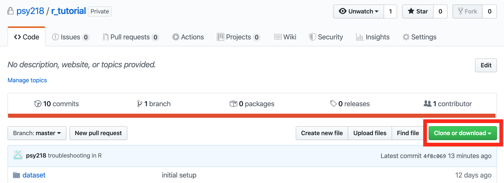
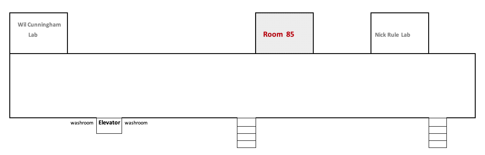

# R Tutorial for PSY2002
## Tutorial materials
* [Intro to R](https://psyc218.s3.ca-central-1.amazonaws.com/r_tutorial/intro_R.html)  
* [RStudio Setup](https://psyc218.s3.ca-central-1.amazonaws.com/r_tutorial/r_environment.html)
* [Troubleshooting in R](https://psyc218.s3.ca-central-1.amazonaws.com/r_tutorial/troubleshoot.html)
* [Practical R](https://psyc218.s3.ca-central-1.amazonaws.com/r_tutorial/practical_r.html?versionId=null)

## Before the Tutorial
* Please download & install [R](https://www.r-project.org/) and [RStudio](https://rstudio.com/products/rstudio/download/).
* Clone or download the tutorial materials by clicking the green button in the top right corner of the repo,
  
or [here](https://minhaskamal.github.io/DownGit/#/home?url=https://github.com/psy218/r_tutorial.git).  
* (*optional*) Review this [R primer](https://psyc218.s3.ca-central-1.amazonaws.com/r_tutorial/tutorial_draft.html?versionId=null). 

## Event Description
* Date: Tuesday, January 7th
* Location: Sidney Smith Rm. 85 (in the subground)
  
* Schedule:
  - 11am - 12:15pm: Intro to R
  - 12:15pm - 12:50pm: RStudio Setup & Troubleshoot in R
  - 1pm - 2pm: Practical R
* Contents
  - **Intro to R**
    - R syntax and grammar
    - Understanding and applying functions
  - **RStudio Setup & Troubleshoot in R**
    - Setting up RStudio to create a self-contained project
    - How to identify and troubleshoot errors in R
  - **Practical R**
    - Tidyverse syntax and grammar (e.g., pipes)
    - Data wrangling with dplyr
