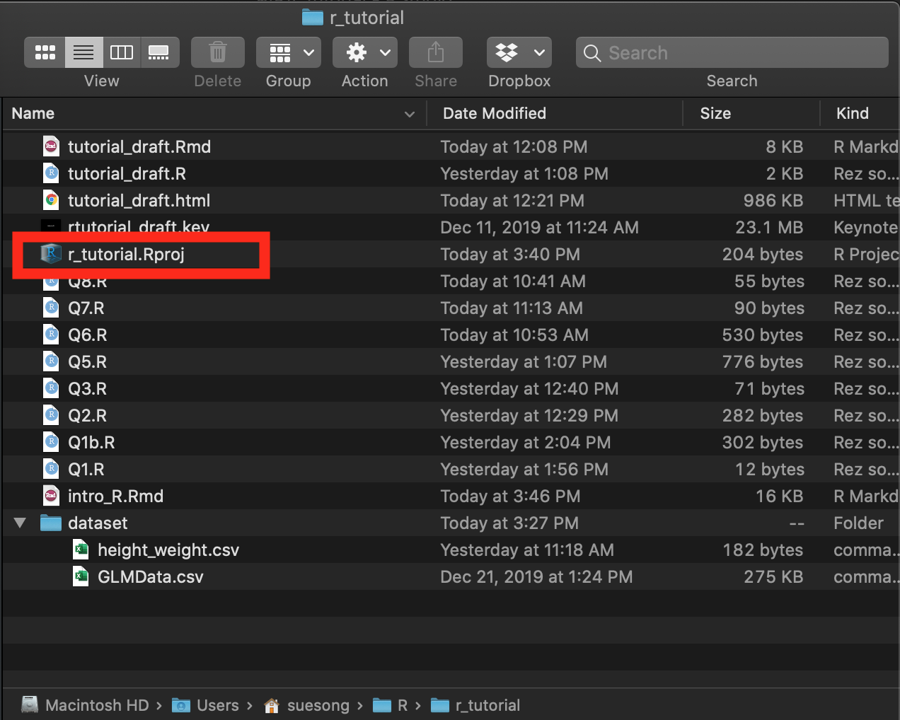

```{r setup, include=FALSE}
# RMarkdown set-up; disregard this 
knitr::opts_chunk$set(echo = TRUE, include = TRUE, message = FALSE, warning = FALSE, tidy = TRUE)
```

# R Packages 
R packages can be thought of as *software* or *applications* that allow you to perform different functions.

## Package installation
Although you have to load your packages into your R environment for every session, you only have to install packages once. 
```{r eval=FALSE}
install.packages(c("tidyverse", "here"))
# packages that are not available on CRAN
devtools::install_github("hadley/emo") 
```

### For PSY2002
These are the packages you would need for PSY2002 lectures. Once you have them installed, you would only have to "load" them into your environment on an as-needed basis. 
```{r eval=FALSE}
install.packages(c("plotrix", "car", # lecture 1
                   "mediation", # lecture 2
                   "lavaan", "semPlot", # Lecture 3
                   "lme4", "lmerTest", "emmeans", "e1071", # Lectures 4 & 5
                   "pscl", "MASS", "boot", # Lecture 6
                   "cluster", # lecture 9
                   "psych", # lecture 10
                   "survival", "km.ci", # lecture 11
                   "TSA", "TTR", "tseries", "nlme" # lecture 12
                   ))

```

## Package loading  
You have to load necessary package(s) to your current R environment using library() function.
```{r}
library("tidyverse")
```

You can check what packages are currently loaded into memory by executing `search()` function. 
```{r}
search()
```

# R environment
Setting up your R environment from the get-go will prevent any future headaches with respect to importing files and exporting your output.  

Your current R session may be opearating at a specific folder, or *working directory* (i.e., WD). Your default working directory may be where your R is installed, like a permanent address. You can change this to a new folder, like a mailing address. 

A mailing address is useful for file organization. When you are importing a file (e.g., a dataset) into your R environment, your R will assume the file is located at the working directory. When you are exporting an output or saving a file (e.g., plots, processed datasets), the default location will also be your working directory. 

## Working Directory 

Let's find where our current R session is operating at. 
```{r eval = FALSE}
getwd()
```

We can look at the files available at the current folder by either going to the *Files* tab in the RStudio panel, or run the following codes.
```{r eval=FALSE}
list.files()
dir()
```

## Absolute vs. Relative Path
In our current working directory (i.e., the folder we are operating in), we only have to specify the location **relative** to the working directory (i.e., **relative path**) as opposed to the full location (i.e., **absolute path**). 

There is a R package for the relative path, `here`. Install & load the package. 
```{r}
# install.packages("here")
library(here)
```


## RStudio Project
To avoid importing and exporting errors, we can create a new project inside the RStudio. 

Consider creating a separate project for every new study and for different purposes (e.g., workshops, courses). 

You can open the RProject project *project_name.Rproj*, which will oepn a separate RStudio window with the scripts you have been working prior to closing.  

For example, you would click on the `r_tutorial.Rproj` when you want to resume working on the project.



### Exercise 1

Let's create a new project for PSY2002. 

Step 1: Creating a new project
File → New Project → New Directory


Having a separate RStudio Project will allow you to have a working directory dedicated for a specific projet. 

Step 2: Importing a file
Create a new folder called *dataset*.
```{r eval=FALSE}
dir.create(here::here("dataset"))
```

Then create a copy of the example dataset called **GLMData.csv**, and move it into the new *dataset* folder.
```{r eval=FALSE}
file.copy(from = here::here("GLMData.csv"), # the original file & its location
          to = here::here("dataset", "GLMData.csv")) # the new folder location
```


## Importing files
We can now use a relative path to import files. 

Import example dataset "GLMData.csv" located in the dataset folder, and assign an object name (e.g., "df").
```{r}
df <- read_csv(here::here("dataset", "GLMData.csv"))
```


# Data Structure
## Accessing data inside a data frame
Let's create a data frame called `basket` that contains different kinds of fruits and veggies. 
```{r}
basket <- data.frame(fruits = sample(stringr::fruit, 3), # randomly selecting 3 fruits
                     veggies = c("carrots", "broccoli", "celery"), # 3 kinds of veggies
                     quantity = c(3, 2, 5)) # number of fruits & veggies
```

### Indexing
We can use a square bracket (i.e., []) to access an element inside a data frame by its location or column names. 

#### By location

```
data.frame[i, j] 
```
The first element (i.e., *i*) corresponds to the row, and the second (i.e., *j*) corresponds to the column. 

| |col j1 |col j2|col j3|
|:-:|:-:|:-:|:-:|
|row i1|[1, 1]|[1, 2]|[1, 3]|
|row i2|[2, 1]|[2, 2]|[2, 3]|
|row i3|[3, 1]|[3, 2]|[3, 3]|

```{r}
basket
```

##### Single elements
For example, we can access the second element in the 2nd column like this:
```{r}
basket[2, # 2nd row
       2] # 2nd column
```

##### Multiple elements
We can access multiple elements by using a vector (`c()`) inside a bracket, or `:`sign. 

```{r}
basket[c(1, 3), # first element in the 3rd column
       c(2, 3)] # second element in the 2nd row & 3rd column

basket[c(1, 3), 
       2:3] # same as c(2, 3)
```

##### Negative index

We can use **negative index** to exclude elements. 

```{r}
basket[-2, -1] # excluding elements in the 2nd row & 1st column
basket[-2, 2:3] # excluding elements in the 2nd row & including elements in the 2nd & 3rd columns
```


#### By column name
We can also use column names. All the codes below will access information stored in the *fruit* column. 

```{r}
basket[ , "fruits"]

basket[["fruits"]]
```

We use the dollar sign (i.e., `$`) to specify a column. 
```{r}
basket$fruits
```

Try pressing the *Tab* key after typing the `dollar sign`.  

#### By conditions
We can also select elements conditionally; that is, we can specify what element we want. 
R will evaluate the statement and return only those elements that meet the specified condition. Conditional statements follow the same mathematical operations:
`==` equal to
`> x` greater than
`< x` less than
`>= x` greater than or equal to
`<= x` less than or equal to.

You can have multiple conditions by using the following operators:
`|` or
`&` and
`%in%` testing multiple elements in a specified vector.

For example, let's say I only want a specific fruit, pear: 
```{r}
basket$fruits[basket$fruits=="pear"] # within the fruit column, element named "pear"
```

Or, the strawberry and apple:
```{r}
basket$fruits[basket$fruits %in% c("apple", "strawberry")]
```

Or, a fruit whose quantity exceeds 3. 
```{r}
basket$fruits[basket$quantity > 3] 
```


A reference list for the operators can be found here: [R Cookbook Table 2.1](https://rc2e.com/SomeBasics.html#tab:precedence)

For the exercises, we will use an example dataset, starwars. 
```{r starwars_data}
# import the example dataset
starwars <- dplyr::starwars

# I am going to mess up the data for our exercises; Run this code for extra challenge. 
library("magrittr")
starwars %<>% 
  mutate_at(vars("height"), as.character) %>%  # height is now a character variable
  mutate(hair_color = replace(hair_color, is.na(hair_color), 999)) %>% 
  mutate(gender = case_when( 
    gender == "female" ~ 0,
    gender == "male" ~ 1,
    gender == "hermaphrodite" ~ 2,
    gender == "none" ~ 3,
    TRUE ~ NA_real_))
```


# Data Manipulation
## 1) Data Preparation  
Before analyzing your data, make sure your data is *clean*. 

Data preparation can involve:   
1) making sure your variables have the correct class attributes 
  - e.g., a numeric variable not coded as character variable
  
2) observations are correctly coded
  - e.g., a question with the 7-point Likert-type scale ranging from 1 to 7 (and not 5 - 11).
  
3) checking missing data


Let's first inspect our dataset using `glimpse()` function from the `tibble` package. 
```{r}
tibble::glimpse(starwars)
```

You can get the names of the variables by running `names()` or `colnames()`. 
```{r}
names(starwars)
colnames(starwars)
```

### Class attribute  
Make sure your variables have the correct data types. 

#### Numeric variables  
Make sure our continuous variables (i.e., height and mass) are numeric. 
```{r}
is.numeric(starwars$height)
is.numeric(starwars$mass)
```

Height variable is not numeirc; convert it to a numeric variable. 
```{r}
starwars$height <- as.numeric(starwars$height)
```


#### Factors
Categorical variables can have a special class attribute as **factors**. You can specify the levels of factors and specify whether these levels are ordered (i.e., levels are sorted into an increasing order) or unordered. 

For example, let's look at the gender variable in our starwars dataset. We can look at the frequency table by using the `table()` function. 
```{r}
table(starwars$gender)
```
There are 4 levels associated with the gender variable:
|level|label|
|:--|:--:|
|0|female|
|1|male|
|2|hermaphrodite|
|3|none|

Let's check if this variable is a factor. 
```{r}
is.factor(starwars$gender)
```
It isn't. 

When we plot using gender as is, gender is treated as a continuous numeric variable like so:
```{r}
ggplot(subset(starwars, mass < 1000), 
       aes(x = height, 
           y = mass, 
           colour = gender)) +
  geom_point() +
  theme_bw()
```


We can convert the gender variable using the `factor()` function.
```{r eval = FALSE}
starwars$gender <- factor(starwars$gender, 
                          levels = c(0:3), # numeric values representing the levels
                          labels = c("female", "male","hermaphrodite", "none"), # corresponding lables for each of the numeric value
                          ordered = FALSE) # change this to TRUE if you want it ordered
```

When we convert our gender variable into a factor, we will see the relationship between height and weight for the four gender groups. 
```{r}
ggplot(subset(starwars, mass < 1000), 
       aes(x = height, 
           y = mass, 
           colour = gender)) +
  geom_point() + 
  theme_bw()
```


### Missing data 
In R, missing values are coded as `NA`.


Let's look at characters whose height is missing by running a logical statement, `is.na()`.
```{r}
head(starwars[is.na(starwars$height)==TRUE, ])
```


We can isolate observations with non-missing height data by negating `is.na()` statement with `!` symbol.
```{r}
head(starwars[!is.na(starwars$height)==TRUE, ])
```


Let's check the total missing values for each variable by running `colSums()` function. 
```{r}
colSums(is.na(starwars))
```


#### Recode NA
For datasets that use different coding for missing values (e.g., 999), we can convert it to `NA`. In our dataset, missing values for `hair_color` variable are coded as 999; let's recode this variable. 
```{r}
starwars$hair_color[starwars$hair_color == 999] <- NA
```

#### Dealing with NA  
Some functions (e.g., `mean()`, `median()`) give you an error when the dataset contains missing values. 
```{r}
mean(starwars$mass)
```

Some functions allow you to specify how NA should be treated with the `na.rm` argument. When you specify `na.rm = TRUE`, missing values (`na`) will be removed (`rm`). 
```{r}
mean(starwars$mass, na.rm = TRUE)
```

Alternatively, we can remove any rows that contain missing values using `na.omit()` or `na.exclude()` function.
```{r}
mean(na.omit(starwars$mass))
mean(na.exclude(starwars$mass))
```


## 2) Data Summary
### Descriptive statistics  
Let's get descriptive statistics of our data. 
Most often used functions are listed below:
```{r eval = FALSE}
mean(x, na.rm = T) # mean
median(x, na.rm = T) # median
sd(x, na.rm = T) # standard deviation
range(x, na.rm = T) # min and max values
```


### Conditional summary
We can use the indexing techniques to compute summary statistics for the subgroups that meet the qualifications. 

For example, we can compute average height of those whose hair colour is brown. 
```{r}
mean(starwars[starwars$hair_color == "brown", ]$height, na.rm = T)
```

Characters with brown hair are tad taller than the average height of all the characters, `r round(mean(starwars$height, na.rm = T), 2)`. 

#### **Exercise 2** {.tabset .tabset-fade .tabset-pills}
##### Question
Within the starwars dataset, find the names of the character whose height falls between the 5th and 95th quantiles. 

##### Answer  

```{r, echo = TRUE, eval = TRUE, code = readLines("Q6.R")}
```


#### **Exercise 3** {.tabset .tabset-fade .tabset-pills}
##### Question
For each of the gender group, find the means and stadnard deviations of their height. 

##### Answer  
```{r, echo = TRUE, eval = TRUE, code = readLines("Q7.R")}
```


## 3) Data Transformation    

Let's use an example data with participant's demographic data (i.e., age, gender) and responses to BFI-10 (Rammstedt & John, 2007)  

Data codebook here:

|variable name|description|variable name|description|
|:-|:-:|:-|:-:|
|pid|participant id| | |
|age|participant age (in years)| | |
|gender|participant gender|BFI_6|is outgoing, sociable|
|BFI_1|is reserved|BFI_7|tends to find fault with others|
|BFI_2|is generally trusting|BFI_8|does a thorough job|
|BFI_3|tends to be lazy|BFI_9|gets nervous easily|
|BFI_4|is relaxed|BFI_10|has an active imagination|
|BFI_5|has few artistic interests|BFI_11|handles stress well|


*Note*. "BFI_1", "BFI_3", "BFI_4", and "BFI_5" are reverse-keyed. 

```{r}
example_data <- readr::read_csv(here::here("dataset", "example_data.csv"))
```

#### Reverse-coding
We can reverse-code variables by creating a custom function with two arguments: the maximum value of our scale (`max`) and the variable we want to reverse code (`x`).
```{r}
# I will name it `reverse_x()`
reverse_x <- function(max, x) {
  (max + 1) - x
}
```

Step 1: Find which items need to be reverse-coded, and store the name into an object.
```{r}
reverse_keyed_items = paste("BFI", c(1, 3, 4, 5), sep = "_")
```

Step 2: Reverse-code the variables
```{r}
reverse_coded_bfi <- apply(example_data[ ,reverse_keyed_items], 2, reverse_x, max = 5)
```

Step 3: Merge it into the dataset
```{r}
reversed_data <- cbind(reverse_coded_bfi, # reverse-coded variables
                       example_data[ -which(names(example_data) %in% reverse_keyed_items)] # original dataset minus items that need to be reverse-coded
) 

head(reversed_data)
```

Or, just do it at one-go. 
```{r eval=FALSE}
reverse_data <- cbind(apply(example_data[ ,paste("BFI", c(1, 3, 4, 5), sep = "_")], 
                            2, reverse_x, max = 5),
                      example_data[ -which(names(example_data) %in% 
                                             paste("BFI", c(1, 3, 4, 5), sep = "_"))]) 
```


### Scoring variable
#### **Exercise 4** {.tabset .tabset-fade .tabset-pills}

##### Question
Create 1) an aggregate score of `extraversion` for each participant by averaging reverse-coded BFI_1 and BFI_6 and 2) mean-center extraversion score on gender. 

##### Answer
```{r, echo = TRUE, eval = TRUE, code = readLines("Q8.R")}
```


# Troubleshooting
## General tips
1. Debug sequentially
Run `traceback()`, and check at which step you got the error message. 
```{r}
```

2. Start small

When there are multiple functions, start from the nested function and work out.
```{r}
```


## Functions
### Help for a function
Looking for a manual for a function in two ways:
1. using ?function
```{r}
?sum
```

2. help(function)
```{r}
help(sum)
```

If help page returns no documentation, try ??function
```{r}
??sum
```

### Funtion arguments
```{r}
args(sum)
```

Type the function name (e.g., sum()) and press `Tab` key


```{r}

```


## Look for relevant functions & packages  
1. [CRAN Task Views](http://cran.r-project.org/web/views/)
Packages related to [Social Science research](http://cran.r-project.org/web/views/SocialSciences.html) and [Reproducible Research](http://cran.r-project.org/web/views/ReproducibleResearch.html)

2. [crantastic](http://crantastic.org)
Keyword-based search tool for R packages.  

3. [ROpenSci](http://ropensci.org/packages/)
Open science tools & R packages 

4. [rseek](http://rseek.org)
Search by name or keyworld 

## Everything failed
Search the web
1. [rseek](http://rseek.org)
2. [StackOverflow](http://stackoverflow.com)

# Resources & References 
## Interactive tutorial with Swirl
```{r eval=FALSE}
install.packages("swirl")
librar("swirl")
swirl()
```

This tutorial heavily relies on the [R Cookbook](https://rc2e.com/), [R for Data Science](https://r4ds.had.co.nz/), and [Data Carpentry](https://datacarpentry.org/).

