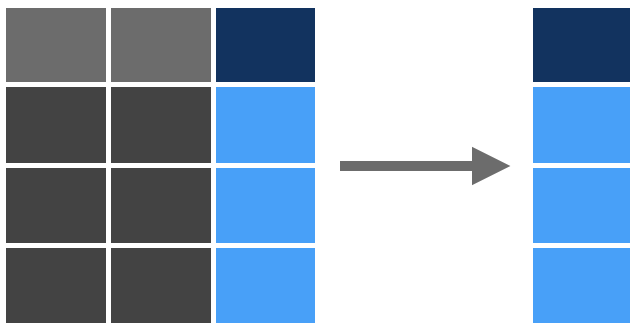

```{r setup, include=FALSE}
# RMarkdown set-up; disregard this 
knitr::opts_chunk$set(echo = TRUE, include = TRUE, message = FALSE, warning = FALSE, tidy = TRUE)
options(digits = 3, scipen = 999)
```


# Tidyverse  
[Tidyverse](https://www.tidyverse.org/) is a collection of R packages that facilitate data manipulation and exploration (cf. [a blog post on not using Tidyverse](https://blog.ephorie.de/why-i-dont-use-the-tidyverse)). 

Let's load tidyverse, and see what packages are included. 
```{r message = TRUE}
library(tidyverse)
```

## core packages   
These are select core packages that are included in Tidyverse:   
1. [ggplot2](https://r4ds.had.co.nz/data-visualisation.html) for data visualization   
2. [dplyr](https://dplyr.tidyverse.org/) for data manipulation   
3. [tidyr](https://r4ds.had.co.nz/tidy-data.html) for tidying data  
4. [readr](https://r4ds.had.co.nz/data-import.html) for data import & export   
5. [tibble](https://r4ds.had.co.nz/tibbles.html) for handling data frames   
6. [purrr](https://r4ds.had.co.nz/iteration.html) for iterative programming  
7. [forcats](https://r4ds.had.co.nz/factors.html) for manipulating factors (i.e., categorical variables)  

*Note* the packages under `tidyverse_conflicts()`; these are tidyverse functions that have the same name as other functions from different packages (e.g., base R).  


For data manipulation exercises, we will use an example dataset, starwars from `dplyr` package. 

```{r}
data(starwars)
```

Let's first inspect our dataset using `glimpse()`.  
```{r}
glimpse(starwars)
```

## **piping** (%>%) 
Base R and tidyverse R take different approaches to perform multiple functions.
Tidyverse R uses the pipe operator (`%>%`), which losely translates as "*then*"  

The pipe operator (`%>%`) becomes handy when you...   

1. have many interim steps     
For example, when we want to run a regression with mean-centered variables   
```{r}
starwars %>% 
  group_by(gender) %>% # step 1) mean centering height around gender
  mutate(height_mc = height - mean(height, na.rm = T)) %>% 
  lm(mass ~ height_mc, # step 2) then run a regression model using the mean-centered height
     data = .) %>% 
  summary # step 3) see the summary table
```

2. do not wish to save the output (e.g., exploratory data analysis)  
For example, when we want to summarize our data and plot the summary data without saving it.
```{r}
starwars %>% 
  #filter(mass < 1000) %>% 
  group_by(gender) %>% 
  summarize_at(vars(c("height", "mass")), list(~mean(., na.rm = T), ~sd(.,na.rm = T))) %>% 
  pivot_longer(cols = -gender, 
               names_to = c("var", "stat"),
               names_sep = "_",
               values_to = "value") %>% 
  spread(stat, value) %>% 
  ggplot(aes(x = as.factor(gender), y = mean, fill = as.factor(var))) +
  geom_col(position = position_dodge(width=0.9)) +
  xlab("Gender") + 
  ylab("Average Measurement") +
  geom_errorbar(aes(ymin = mean - sd, ymax = mean + sd), 
                position = position_dodge(width=0.9), width = 0.25) + 
  scale_fill_discrete("") +
  theme_bw()
```


As an example, let's calculate the average height of female Starwars characters.

<div class = "row">
<div class = "col-md-6">
<br><br> Base R   
In order to perform multiple functions using base R, we perform them sequentially or nest multiple functions. 
```{r ex1_baseR, eval = FALSE}
# sequential operations
female_height_only <- starwars[starwars$gender=="female", ]$height # subset data 
mean(female_height_only, na.rm = T) # calculate mean of the subset

# nesting subset function inside mean
colMeans(subset(starwars, # subsetting the data frame 
                subset = gender == "female", # based on the condition 
                select = "height"), # column of interest
         na.rm = T) # then perform mean on the subsetted data
```
</div>

<div class = "col-md-6">
<br><br>tidyverse R    
tidyverse uses a pipe (`%>%`) to perform multiple functions sequentially without creating an object. 
```{r ex1_tidyverseR, eval = FALSE}
starwars %>% # take the starwars dataset
  subset(subset = gender == "female", select = "height") %>% # subset the data
  colMeans(na.rm = T) # calculate the mean
```
</div>
</div>


## *dplyr* verbs  

There are [5 dplyr functions](https://dplyr.tidyverse.org/) that are useful for data manipulation. 

|verb|function|example|
|:-|:-|:-|
|`select()`|choose variables by (column) names|`select(starwars, height, mass)`|
|`filter()`|choose observations by (conditional) values|`filter(starwars, gender == "none")`|
|`mutate()`|transform or create new variables|`mutate(starwars, BMI = $weight/height^2$)`|
|`summarize()`|summarize variables|`summarize(starwars, mean_height = mean(height, na.rm = T))`|
|`arrange()`|order variables|`arrange(starwars, height, desc(mass))`|

# Data Manipulation  
## Subsetting data with `select()` & `filter()`  

### `select()` columns    
Like the square bracket `[]`, the dollar sign `$` in base R, and `subset(data, select = column)`, `select(x)` allows you to extract elements by the column name(s). 



<div class = "row">
<div class = "col-md-6">
<br><br>Base R
```{r rows.print = 5}
starwars[ ,c("height", "mass")]
```
</div>

<div class = "col-md-6">
<br><br>Tidyverse R
```{r rows.print = 5}
starwars %>% 
  select(height, mass) 
```
</div>
</div>

#### conditional selection

You can combine `select()` function with conditional statements such as `starts_with()`. 

For example, if we want to find all the columns whose names that do NOT (i.e., negating with the minus sign, `-`) begin with the letter *s*, we can nest the conditional statement, `starts_with("s")` inside the `select()` function. 

```{r rows.print=5, cols.print=5}
starwars %>% 
  select(-starts_with("s")) 
```

These are some useful conditional statements you can use with `select()`:   

|condition|function|
|:-|:-|
|`starts_with("x")`|column names that begin with "x"|
|`ends_with("x")`|column names that end with "x"|
|`contains("x")`|column names that contain "x"|
|`num_range("x", 1:3)`|columns that match `x1`, `x2`, and `x3`|
|`everything()`|select everything|
|`one_of(c("height", "mass"))`|select one of `height` or `mass`|


### `filter()` observations  

Like the conditional statement inside the square bracket `[]`, `filter()` allows you to extract elements that meet the specified conditions.   
  

<div class = "row">
<div class = "col-md-6">
<br><br>Base R
```{r rows.print=5, cols.print=5}
starwars[c(starwars$mass<1000 & starwars$height > 100), ]
```

</div>

<div class = "col-md-6">
<br><br>tidyverse R
```{r rows.print=5, cols.print=5}
starwars %>% 
  filter(mass < 1000, height > 100)
```
</div>
</div>  

#### conditional filtering  
Like `select()`, you can add more specification inside the `filter()` function with logical operators (e.g., `==`), and `between()` or `is.na()` statements. 

```{r include = FALSE, cols.print=5, rows.print=5}
starwars %>% 
  filter(!is.na(mass)) # choosing observations that do NOT have missing data for mass 
  
```


### **Exercise 1** {.tabset .tabset-fade .tabset-pills}  
Let's subset our starwars data set using multiple conditions. 

#### Question
Find the names (`name`) and gender (`gender`) of human characters (i.e., `species == Human`) who are between 23 to 35 years of age (i.e., `birth_year`)and do not have blue eyes (i.e., `eye_colour`). 

#### Answer  
```{r, echo = TRUE, eval = TRUE, code = readLines("ex_ans/pr_Q1.R")}
```


## Summarize data with `mutate()` and `summarize()`   

### `mutate()` variables  
`mutate()` creates a new variable by operating on our dataset. 

  

<div class = "row">
<div class = "col-md-6">
<br><br>Base R
```{r eval = FALSE}
# using `within()`
within(starwars, 
       {bmi = 703 * mass/(height^2)})

# Or, writing directly inside
starwars$bmi = 703 * starwars$mass/(starwars$height^2)
```
</div>

<div class = "col-md-6">
<br><br>tidyverse R
```{r rows.print=5}
starwars %>% 
  mutate(bmi = 703 * mass/(height^2)) %>% 
  select(name, height, mass, bmi) 
```
</div>
</div>

#### conditional mutation  

We can conditionally mutate our datasets based on variable names (`mutate_at()`) and specific conditions (`mutate_if()`). 

##### `mutate_at()` to score variables  

Let's use an example data with participant's demographic data (i.e., age, gender) and responses to BFI-10 (Rammstedt & John, 2007).  

Data codebook here:  

|variable name|description|variable name|description|
|:-|:-:|:-|:-:|
|pid|participant id| | |
|age|participant age (in years)| | |
|gender|participant gender|BFI_6|is outgoing, sociable|
|BFI_1|is reserved|BFI_7|tends to find fault with others|
|BFI_2|is generally trusting|BFI_8|does a thorough job|
|BFI_3|tends to be lazy|BFI_9|gets nervous easily|
|BFI_4|is relaxed|BFI_10|has an active imagination|
|BFI_5|has few artistic interests|BFI_11|handles stress well|


*Note*. "BFI_1", "BFI_3", "BFI_4", and "BFI_5" are reverse-keyed. 

```{r}
# example_data <- readr::read_csv(here::here("dataset", "example_data.csv"))
example_data <- readr::read_csv("https://raw.githubusercontent.com/psy218/r_tutorial/master/dataset/example_data.csv")
```

Let's reverse score, and create aggregate scores of OCEAN. 

Step 1: I am creating a custom function to reverse score items. 
```{r}
reverse_x <- function(x, max) {
  ifelse(is.na(x) == FALSE, (max + 1) - x , NA)
}
```

Step 2: Reverse score items (without saving) and calculate an aggregate score  
```{r rows.print = 5, cols.print = 5}
example_data %>% 
  mutate_at(vars(paste("BFI", c(1, 3:5, 7, 11), sep = "_")),  # selecting which variables to reverse score
            ~reverse_x(., max = 5)) %>% # apply our custom functions 
  mutate(extraversion = rowMeans(cbind(BFI_1, BFI_6), na.rm = T), # then create a new variable to store aggregate scores
         conscientiousness = rowMeans(cbind(BFI_3, BFI_8), na.rm = T),
         neuroticism = rowMeans(cbind(BFI_4, BFI_9, BFI_11), na.rm = T),
         agreableness = rowMeans(cbind(BFI_2, BFI_7), na.rm = T),
         openness = rowMeans(cbind(BFI_5, BFI_10), na.rm = T)) 
  
```


### `summarize()` data  

Without creating a new variable, we can create a summary of our data. For example, let's look at average height and mass with their standard deviations using `mean()` and `sd()` function. 


```{r}
starwars %>% 
  summarize(height_mean = mean(height, na.rm = T),
            height_sd = sd(height, na.rm = T),
            mass_mean = mean(mass, na.rm = T),
            mass_sd = sd(mass, na.rm = T))
```


```{r}
# alternatively, you can use `summarize_at()` if you are feeling terse
starwars %>% 
  summarise_at(vars(height, mass), # variables we want to apply functions on
               list(~mean(., na.rm = T), # first function 
                    ~sd(., na.rm = T))) # second function
```

#### summary functions  
You can use the following functions with `summary()`. 

|name|function|
|:-|:-|
|`n()`|# of observations or row |
|`mean(x)`|average of x |
|`sd(x)`|standard deviation of x |
|`min(x)`|minimum value of x |
|`max(x)`|maximum value of x |
|`sum(is.na(x))`|# of missing observations|


```{r}
starwars %>% 
  summarize(height_n = n(),
            height_mean = mean(height, na.rm = T),
            height_sd = sd(height, na.rm = T),
            height_min = min(height, na.rm = T),
            height_max = max(height, na.rm = T),
            height_na = sum(is.na(height)))
```
Check for more useful summary functions with `?summarize()` 

#### selective summary with `summarize_at()`   

You can selectively apply the same functions to multiple variables using `summarize_at()`:  
```{r}
starwars %>% 
  summarize_at(.vars = vars("height", "mass"), # specify which variables  
               .funs = list(~mean(., na.rm = T), # list of functions you want to apply
                    ~sd(., na.rm = T),
                    ~min(., na.rm = T),
                    ~max(., na.rm = T),
                    ~sum(is.na(.)))) %>% 
  pivot_longer(cols = everything(), # (optional) to make the summary table easier to read  
               names_to = c(".value", "test"),
               names_sep = "_")
```


#### conditional summary with `group_by()`  
When we want to create a summary for different groups (e.g., gender), we can combine `mutate()` and `summarize()` with `group_by()` function.  

For example, we can calculate average height and mass for each gender group.  
```{r}
starwars %>% 
  group_by(gender) %>% # grouping our data based on gender
  summarise_at(vars(height, mass), 
               list(~mean(., na.rm = T), 
                    ~sd(., na.rm = T))) 
```

Use `ungroup()` to remove grouping.  
```{r}
starwars %>% 
  ungroup()
```


#### **Exercise 2** {.tabset .tabset-fade .tabset-pills}  
##### Question  
Create an aggregate score of `neuroticism` for each participant by 1a) reverse-coding BFI_4, and BFI_11, 1b) averaging neuroticm items (i.e., BFI_4, BFI_9, and BFI_11), and 2) mean-center neuroticism score on gender. 

##### Answer    
```{r, echo = TRUE, eval = TRUE, code = readLines("ex_ans/pr_Q2.R")}
```


