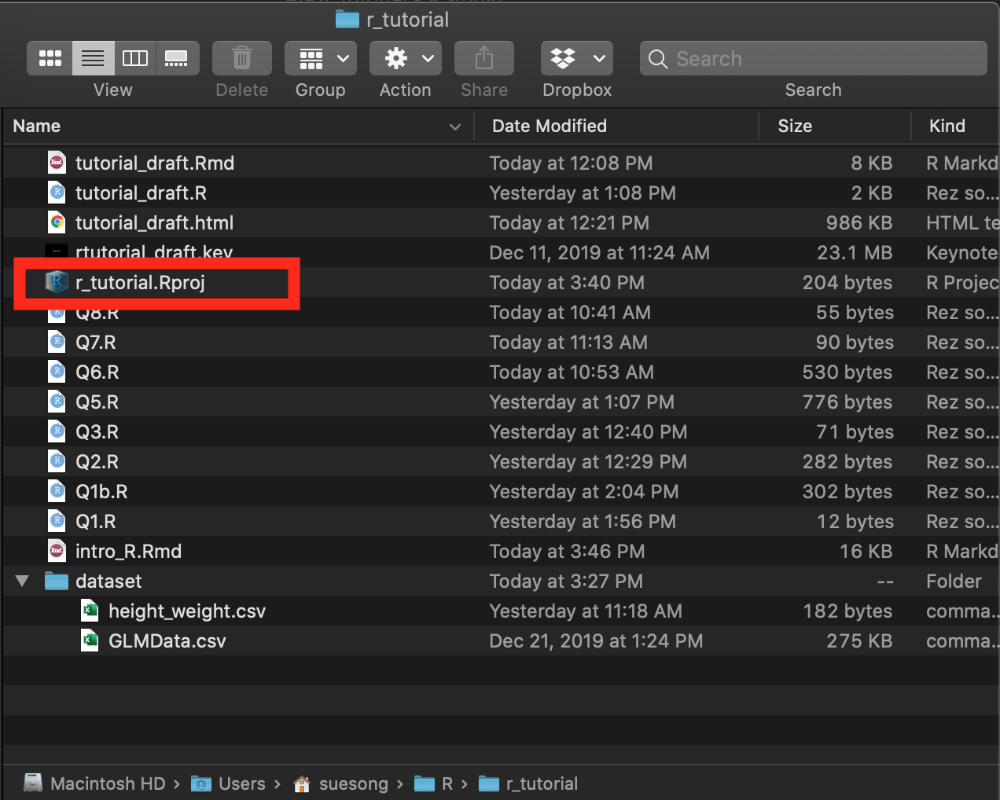

```{r setup, include=FALSE}
knitr::opts_chunk$set(echo = TRUE, include = TRUE, message = FALSE, warning = FALSE, tidy = TRUE)
options(digits = 3, scipen = 999)
```

# R Packages 
R packages can be thought of as *software* or *applications* that allow you to perform different functions.

## Package installation
Although you have to load your packages into your R environment for every session, you only have to install packages once. 
```{r eval=FALSE}
install.packages(c("tidyverse", "here"))
# packages that are not available on CRAN
devtools::install_github("hadley/emo") 
```

### For PSY2002
These are the packages you would need for PSY2002 lectures. Once you have them installed, you would only have to "load" them into your environment on an as-needed basis. 
```{r eval=FALSE}
install.packages(c("plotrix", "car", # lecture 1
                   "mediation", # lecture 2
                   "lavaan", "semPlot", # Lecture 3
                   "lme4", "lmerTest", "emmeans", "e1071", # Lectures 4 & 5
                   "pscl", "MASS", "boot", # Lecture 6
                   "cluster", # lecture 9
                   "psych", # lecture 10
                   "survival", "km.ci", # lecture 11
                   "TSA", "TTR", "tseries", "nlme" # lecture 12
                   ))

```

## Package loading  
You have to load necessary package(s) to your current R environment using library() function.
```{r}
library("tidyverse")
```

You can check what packages are currently loaded into memory by executing `search()` function. 
```{r}
search()
```

Keep track of the package versions with `sessionInfo()`. 
```{r}
print(sessionInfo(), locale = FALSE, RNG = FALSE)
```


# R environment
Setting up your R environment from the get-go will prevent any future headaches with respect to importing files and exporting your output.  

Your current R session may be opearating at a specific folder, or *working directory* (i.e., WD). Your default working directory may be where your R is installed, like a permanent address. You can change this to a new folder, like a mailing address. 

A mailing address is useful for file organization. When you are importing a file (e.g., a dataset) into your R environment, your R will assume the file is located at the working directory. When you are exporting an output or saving a file (e.g., plots, processed datasets), the default location will also be your working directory. 

## Working Directory 

Let's find where our current R session is operating at. 
```{r eval = FALSE}
getwd()
```

We can look at the files available at the current folder by either going to the *Files* tab in the RStudio panel, or run the following codes.
```{r eval=FALSE}
list.files()
dir()
```

## Absolute vs. Relative Path
In our current working directory (i.e., the folder we are operating in), we only have to specify the location **relative** to the working directory (i.e., **relative path**) as opposed to the full location (i.e., **absolute path**). 

There is a R package for the relative path, `here`. Install & load the package. 
```{r}
# install.packages("here")
library(here)
```

## R & RStudio versions  
As of today, `r Sys.Date()`, the most updated versions of R and RStudio are 3.6.2 and 1.2.5033, respectively. 

Check you R version, and 
```{r}
getRversion()
```
your RStudio version from `RStudio` -> `About RStudio`:


You may encounter errors related to the old versions of R; consider keeping your R relatively updated. 

## RStudio Project
To avoid importing and exporting errors, we can create a new project inside the RStudio. 

Consider creating a separate project for every new study and for different purposes (e.g., workshops, courses). 

You can open the RProject project *project_name.Rproj*, which will oepn a separate RStudio window with the scripts you have been working prior to closing.  

For example, you would click on the `r_tutorial.Rproj` when you want to resume working on the project.



### Exercise 1

Let's create a new project for PSY2002. 

Step 1: Creating a new project
File → New Project → New Directory


Having a separate RStudio Project will allow you to have a working directory dedicated for a specific projet. 

Step 2: Importing a file
Create a new folder called *dataset*.
```{r eval=FALSE}
dir.create(here::here("dataset"))
```

Then create a copy of the example dataset called **GLMData.csv**, and move it into the new *dataset* folder.
```{r eval=FALSE}
file.copy(from = here::here("GLMData.csv"), # the original file & its location
          to = here::here("dataset", "GLMData.csv")) # the new folder location
```


## Importing files
We can now use a relative path to import files. 

Import example dataset "GLMData.csv" located in the dataset folder, and assign an object name (e.g., "df").
```{r}
df <- read_csv(here::here("dataset", "GLMData.csv"))
```

