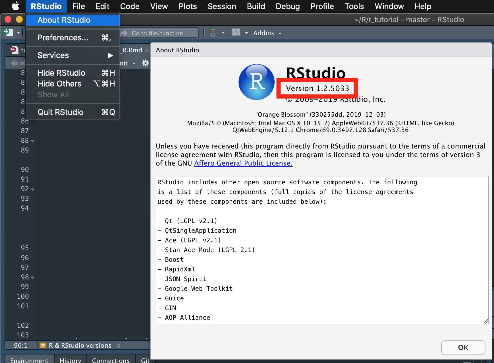
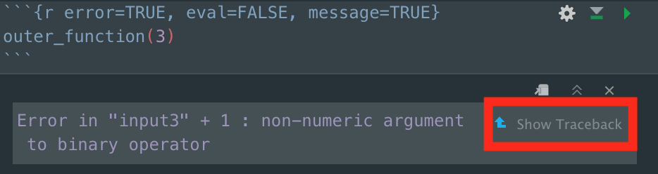
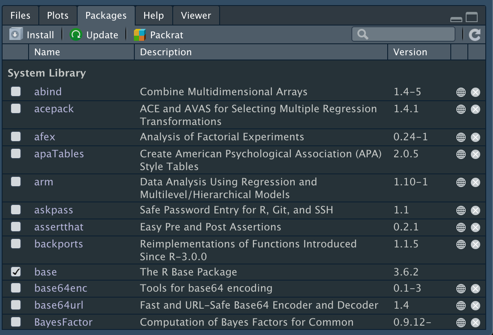
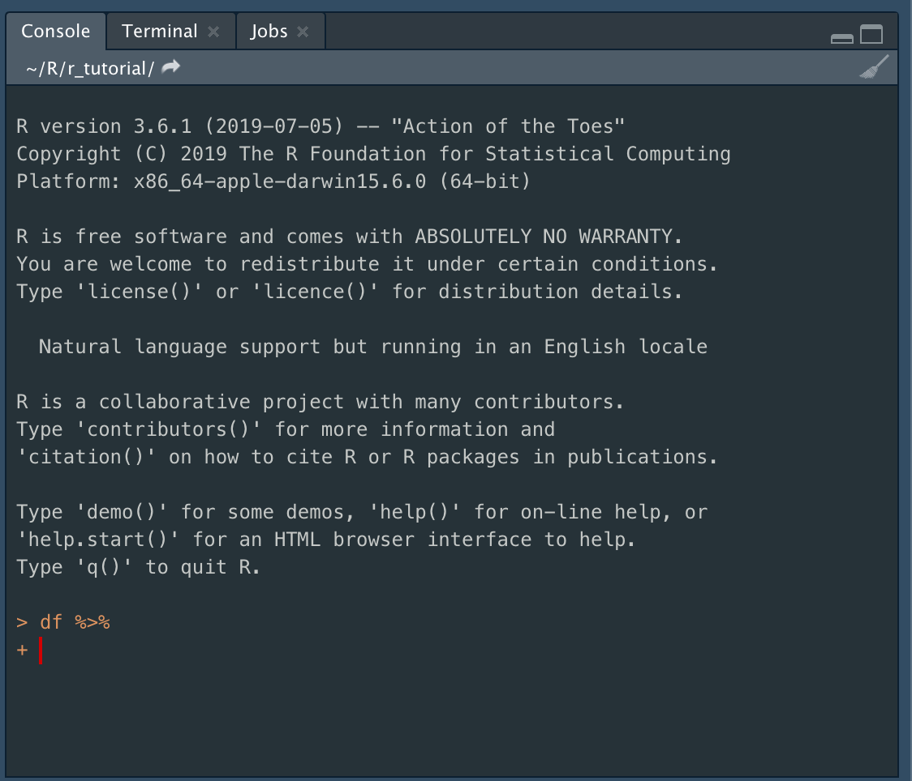
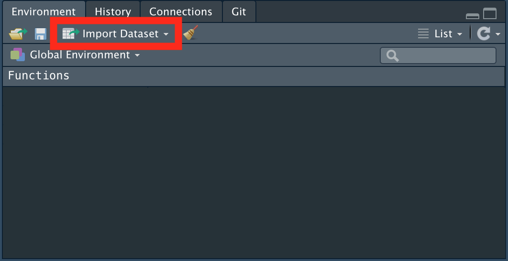

```{r setup, include=FALSE}
knitr::opts_chunk$set(echo = TRUE, include = TRUE, message = FALSE, warning = FALSE, tidy = TRUE)
```

# Troubleshooting

## General tips
### 0. Update your R and RStudio  
As of today, `r Sys.Date()`, the most updated versions of R and RStudio are 3.6.2 and 1.2.5033, respectively. 

Check your R and RStudio versions regularly by running this code (for R),
```{r}
R.version.string
```
   
and RStudio -> About RStudio (for RStudio)   


You may encounter errors related to the old versions of R; consider keeping your R and RStudio up to date. 

`Restart R` periodically: Session -> Restart R   


### 1. Debug sequentially

Functions may rely on other subordinate function(s), which may be the source of an error. For example, `outer_function()` relies on `nested_function()`, which relies on `nested_nested_function()`. 
```{r}
outer_function <- function(input1) nested_function(input1)
nested_function <- function(input2) nested_nested_function(input2)
nested_nested_function <- function(input3) "input3" + 1
```

When we run the `outer_function()`, we will see an error message.
```{r error=TRUE, message=TRUE}
outer_function(3)
```

When this occus, we need to identify the very first function and work from there. 

You can either press `Show Traceback` option, 
   

or run `traceback()`, and check at which step you got the error message. 

If you are running all the functions in one line, work from the inner-most function (i.e., `nested_nested_function()`) and work out:
```{r error=TRUE, message=TRUE}
outer_function(nested_function(nested_nested_function(3)))
```


### 2. Practice nonattachment 

Dry-run your codes before saving it as an object or making a permanent change (e.g., creating a new column in a dataset).   
```{r eval = FALSE}
# bmi_summary <- 
starwars %>% 
  # select(height, mass, gender) %>% 
  mutate(bmi = 703 * mass/(height^2)) %>% 
  group_by(gender) %>% 
  summarize(bmi_mean = mean(bmi, na.rm = T),
            bmi_sd = sd(bmi, na.rm = T))
```


### 3. Be consistent   
Name your objects (or variables, functions) with a clear rule that makes sense to you; a consistent naming convention will go a long way.   

For example, I specify the type of an object at the end of an object name, following `_`. For example, I name my regression summary output as `model_lm`:
```{r eval = FALSE}
heightMass_lm <- starwars %>% 
  lm(height ~ mass,
     data = .) %>% 
  summary
```

For datasets, I used `name_dataset`:
```{r eval=FALSE}
starwars_dataset <- dplyr::starwars
```

For variables, I use consistent abbreviations:   
`variable.gc` group-centered   
`variable.c` (mean-)centered   
`variable.rs` reverse-scored    


## Packages & Functions
### Package installation  
If you have problem installing packages, check this [help page](https://support.rstudio.com/hc/en-us/articles/200554786-Problem-Installing-Packages).  


### Package loading   
```{r error = TRUE}
library(nonexistent_package)
```

If you get this error although you swear you installed it a million times,    

a) check whether you can find it under System Library in the Packages tab  
  


b) check where your packages are installed    
```{r}
.libPaths()
```

c) install for the last time the package using the RStudio Packages tab:


### Help for a function
Looking for a manual for a function in two ways:   

1. using ?function
```{r}
?sum
```

2. help(function)   
```{r}
help(sum)
```

If help page returns no documentation, try `??function`  
```{r}
??sum
```

### Funtion arguments   
```{r}
args(sum)
```

Type the function name (e.g., sum()) and press `Tab` key


## Look for relevant functions & packages   
1. [CRAN Task Views](http://cran.r-project.org/web/views/)
Packages related to [Social Science research](http://cran.r-project.org/web/views/SocialSciences.html) and [Reproducible Research](http://cran.r-project.org/web/views/ReproducibleResearch.html)

2. [crantastic](http://crantastic.org)
Keyword-based search tool for R packages.  

3. [ROpenSci](http://ropensci.org/packages/)
Open science tools & R packages 

4. [rseek](http://rseek.org)
Search by name or keyworld 

## Everything failed
Search the web
1. [rseek](http://rseek.org)
2. [StackOverflow](http://stackoverflow.com)


# Common errors
For more details, check Noam Ross's [analysis of the most common errors](https://github.com/noamross/zero-dependency-problems/blob/master/misc/stack-overflow-common-r-errors.md) asked on Stack Overflow. 
  

## [Object not found](http://varianceexplained.org/courses/errors/) {.tabset .tabset-fade .tabset-pills}  

### Error   

```{r message=TRUE, error=TRUE}
Basket
```


### Solutions  
a) R is case-sensitive
```{r echo=TRUE, eval = FALSE}
some_object
```

b) Code that assigned the object was not ran
Try `Cmd` or `Ctlr` + `F` to find the line that assigns the object.  

c) Specify what you want to do in your code
R does not treat `space` between objects as multiplication 
```{r eval=FALSE}
some_object (x + 1)
```
specify the operation with `*`
```{r eval=FALSE}
some_object*(x+1)
```


## [Function not found](http://varianceexplained.org/courses/errors/) {.tabset .tabset-fade .tabset-pills}  

### Error  
```{r echo=TRUE, message=TRUE, error=TRUE}
some_function(x)
```

### Solutions  

Different packages may include different functions of the same name, which will create a conflict. 

When you get an error that a function cannot be found, explicitly specify what package includes the function you are referring to by using `package_name::function`. 

```{r echo=TRUE, eval=FALSE}
package_function_is_from::some_function(x)
```

For older versions of R, these are some *problem* functions that can be resolved with this technique:

```
dplyr::select()
psych::alpha()
```

## Syntax Error {.tabset .tabset-fade .tabset-pills}  
### Error   

```{r message=TRUE, error=TRUE}
# retain observations for those whose height is smaller than 100 or equal to 200. 
starwars[starwars$height < 100 | = 200, ]
```

### Solutions
Chekc your logical operators   

```{r, echo =TRUE, eval = TRUE, code = readLines("ex_ans/ts_error3.R")}
```

Make sure each logical operator is accompanied by its corresponding object(s), and check your operators are correctly specified. For example, one equal sign (`=`) is designated for object assignment; two equal signs (`==`) should be used to denote equal to. 

## No Output {.tabset .tabset-fade .tabset-pills}    
There may be times where R doesn't return anything even though you are running multiple codes. This is indicated by the prompt sign change from `>` to `+`:  


### Error   
Fix these errors:  
a) 
```{r message=TRUE, error=TRUE}
starwars %>% 
  dplyr::select(height, mass
```
   
b)  
```{r message=TRUE, error=TRUE}
starwars[ ,c("height", "mass)]
```

### Solution  

The prompt sign `+` denotes incomplete code. When this happens, 
a) check whether you forgot to close a bracket in your code; Type `)` to close the bracket  

```{r, echo = TRUE, eval = TRUE, code = readLines("ex_ans/ts_error4a.R")}
```

b) check your quotes   
```{r, echo = TRUE, eval = TRUE, code = readLines("ex_ans/ts_error4b.R")}
```

c) Or hit `esc` key  
This will cancel the incomplete code, and allows you to inspect the code.  

## ...cannot open {.tabset .tabset-fade .tabset-pills}  
### Error   

```{r error = TRUE, message = TRUE}
data_to_import <- readr::read_csv("path_to_my_R_folder/folder_that_contains_my_data/dataset_name.csv")
```


### Solutions

This error is usually caused by either nonexistent file or incorrect path. Make sure the file is located in the specified path, and your working directory is correctly defined (if you are using a relative path). 
```{r}
getwd()
```

If the error persists, use `Import Dataset` instead:   

 


## ...subscript out of bounds {.tabset .tabset-fade .tabset-pills}    
You may get an error message that says your subscript is out of bounds. 

### Error    
```{r error = TRUE, message = TRUE}
starwars[ ,c(140, 110)]
```

### Solution  
This error usually denotes nonexistent element; check whether you are trying to access existing elements.  
```{r}
dim(starwars)
```
The first corresponds to the number of rows (observations) and the second corresponds to the number of columns (variables).  

## Missing values {.tabset .tabset-fade .tabset-pills}   
### Error   
`NA` serves as a placeholder for missing values. Untreated NAs may (or may not) throw an error message.   

a) 
```{r message=TRUE, error=TRUE}
starwars %>% 
  lm(height ~ mass, 
     na.action = NULL,
     data = .)
```

b) 
```{r}
mean(starwars$mass)
```

### Solutions  
a) 
```{r, echo = TRUE, eval = TRUE, code = readLines("ex_ans/ts_error7a.R")}
```

b) 
```{r, echo = TRUE, eval = TRUE, code = readLines("ex_ans/ts_error7b.R")}
```

# Misc. errors  
Let's try to troubleshoot some errors you may encounter in the course using Liz's GLM dataset:
```{r}
glm_data <- readr::read_csv("https://raw.githubusercontent.com/psy218/r_tutorial/master/dataset/GLMData.csv")
```

## Example 1 {.tabset .tabset-fade .tabset-pills}   
### Error  
When you are running a binomial logistic regression, you may encounter an error like this:  
```{r error=TRUE}
# base R
summary(glm(sex ~ happiness + marital_status, 
            family = "binomial",
            data = glm_data))

# tidyverse R
glm_data %>% 
  glm(sex ~ happiness + marital_status,
      family = "binomial", 
      data = .) %>% 
  summary
```

Try troubleshooting it. 

### Solution  
```{r, echo = TRUE, eval = TRUE, code = readLines("ex_ans/ts_error8.R")}
```


# Resources & References 

This tutorial heavily relies on the [R Cookbook](https://rc2e.com/), [R for Data Science](https://r4ds.had.co.nz/), and [Data Carpentry](https://datacarpentry.org/).


## Interactive tutorial with Swirl  
The {swirl} package offers interactive lessons within R. 
```{r eval=FALSE}
install.packages("swirl")
librar("swirl")
swirl::install_course_github("matt-dray", "tidyswirl") # for tidyverse course
# swirl() # uncomment this to start the course
```

Check out swirl lessons available for download [here](https://swirlstats.com/scn/title.html).  

