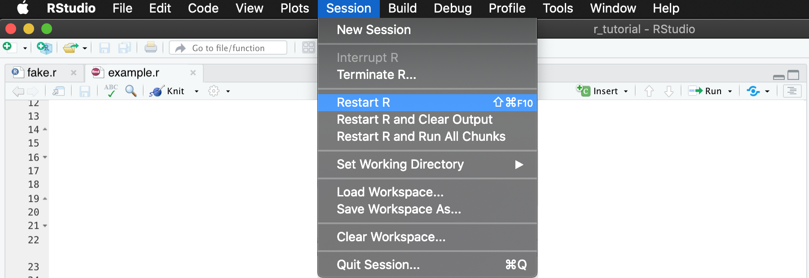
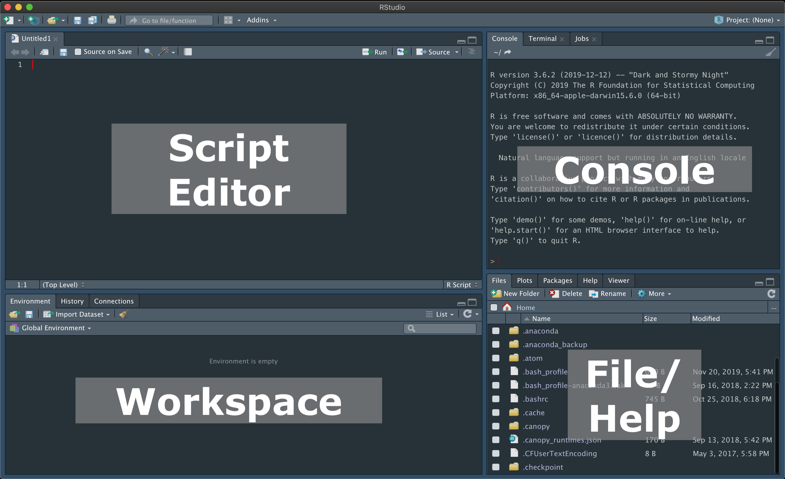
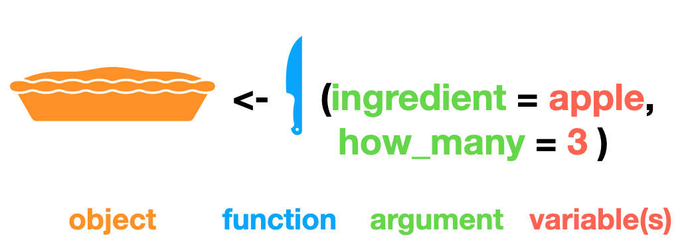
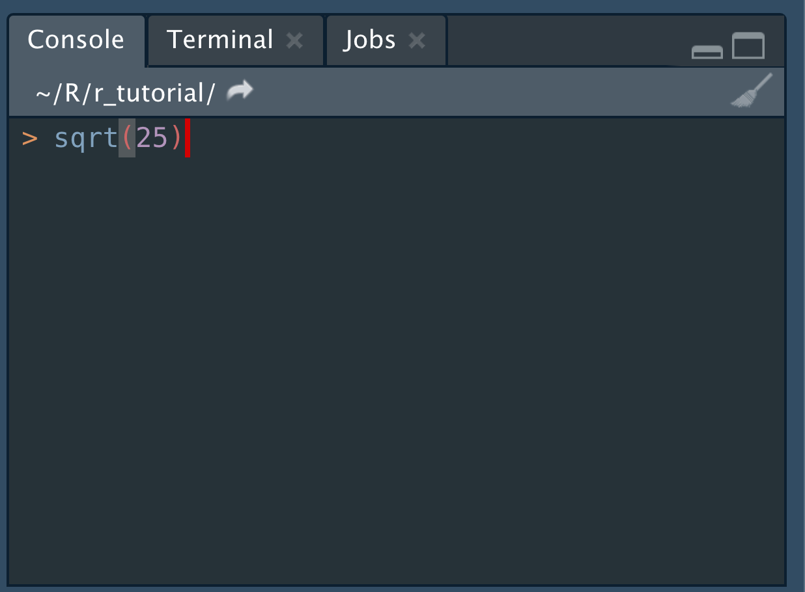
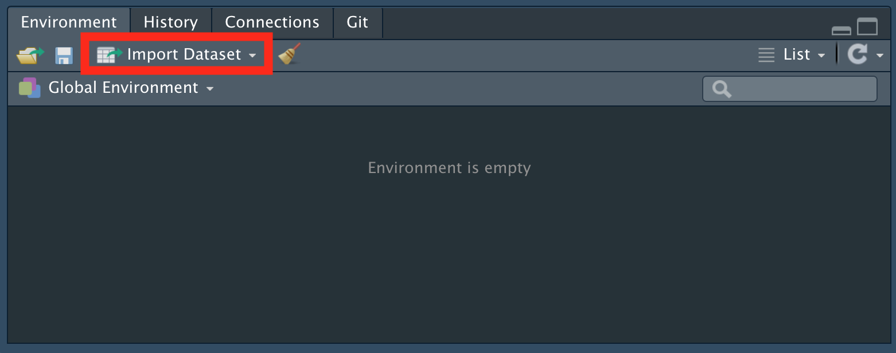

```{r setup, include=FALSE}
# RMarkdown set-up; disregard this
knitr::opts_chunk$set(echo = TRUE, message = FALSE, warning = FALSE, tidy = TRUE)
```

# RStudio & R Environment  
**R** is a programming language for statistical computing, and **RStudio** is a *separate* tool/ application that facilitates using R. Because they are separate applications, you need to install and update them separately:  
[**R**](https://www.r-project.org/)    
[**RStudio**](https://rstudio.com/). 

You can launch RStudio to do things with R without having to launch R separately; however, you should restart R regularly even if you start a new RStudio session: 


This is because even if your RStudio session may be fresh, your R may have accumulated things from a previous R session.  

## RStudio panes  

<table>
  <thead>
    <tr>
      <td><b>Panes</b></td>
      <td><b>Tabs</b></td>
      <td><b>Descriptions</b></td>
    </tr>
  </thead>
  <tbody>
    <tr>
      <td><b>script editor</b></td>
      <td>r-scripts</td>
      <td>this is where your <i>r-scripts</i> will be; think of a <i>r-script</i> as a notebook on which you write and edit all the computations you perform using R. Note that the result/ output of these computations won't be saved in an r-script</td>
    </tr>
    <tr>
      <td><b>workspace</b></td>
      <td>environment</td>
      <td>lists things that are available in a given session, such as dataset you imported and a custom function</td>
    </tr>
    <tr>
      <td><b>console</b></td>
      <td>console</td>
      <td>console is where you communicate with R to do things (e.g., computation, graph), and it will show you what R is doing and its result (e.g., computing results). If you want a papertrail of what you ask R to do, write a line of code in a r-script and run that line with Run button</td>
    </tr>
    <tr>
      <td rowspan = 4><b>file/help</b></td>
      <td>files</td>
      <td>shows you local files stored in your computer</td>
    </tr>
    <tr>
      <td>plots</td>
      <td>previews of a plot you create with R</td>
    </tr>
    <tr>
      <td>packages</td>
      <td>lists all the packages that you have installed </td>
    </tr>
    <tr>
      <td>help</td>
      <td>shows you manuals for R functions and packages</td>
    </tr>
  </tbody>
</table>


More details [here](https://bookdown.org/ndphillips/YaRrr/the-four-rstudio-windows.html). 

## Packages {#packages} 
Packages are like applications (e.g., Microsoft Word, Chrome) that your default R may not be equipped with. 

We download these applications with `install.packages()` function. Let's **install** a package called `readr`, which makes importing data into R easier & faster.   
```{r eval=FALSE}
install.packages("readr")
```

Once we have the package installed, we now have to **load** the package to our current R environment with `library()` function. 
```{r eval=FALSE}
library(readr)
```
Although you have to install a package only ONCE (because it installs on your computer), you have to load the pakcage you need to use every time you start a new R session. 


In prepration of the tutorial, please install **Tidyverse**.
```{r eval=FALSE}
install.packages("tidyverse")
```

In addition to Tidyverse, these are some packages that I often use:  

|  pakcage name|  function |  description |
|:--|:--|:------------|
| here|  `here()`|  find & import files using relative paths |
| psych|  `alpha()`|  computes internal consistency (e.g., alpha, omega) |
| e1071|  `skewness()`; `kurtosis()`|  computes skewness and kurtosis |
| corrr|  `correlate()`|  zero-order correlations |
| car|  `Anova()`|  computes type-III analysis-of-variance |
| emmeans|  `emmeans()`|  for marignal means |
| lme4|  `lmer()`|  fit multilevel linear regression models |
| lmerTest|  `lmer()`| an add-on for `lme4`; computes degrees of freedom & returns p-values associated with test statistics|
| lavaan|  `sem()`|  fit structural equation models |


Different packages may include different functions that have the same name, which will confuse R. 

When you get an error that a function cannot be found, explicitly specify what package includes the function you are referring to by using `package_name::function`. 

```{r echo=TRUE, eval=FALSE}
package_function_is_from::some_function(x)
```

***   
# R basic building block
## R syntax  
R grammar is made up of 4 parts: [object](#object), [function](#function), argument, and variables.   

Baking an apple pie as an example, an *apple pie* is an object, a *knife* is a function (from a package), and a *recipe* is an argument (e.g., ingredient) and variables (e.g., 3 apples).

This can be translated as the following r code:  
```{r eval=FALSE}
# this is just for demonstration; the following line of code will give you an error in your R, because there is no function called `knife`
apple_pie <- knife(ingridient = apple, 
                   how_many = 3)
```


## Functions {#function}  
We can perform **basic arithmetic** in R using the same mathematical operators.

|operator|function|example|
|:--:|:--|:--|
|`+`|plus|`x + y`|
|`-`|minus|`x - y`|
|`*`|multiply|`x * y`|
|`/`|divide|`x / y`|

```{r}
1 + 1
```

These are functions for common calculations that are useful for **descriptive statistics**:  
```
mean(x)   # average of x 
median(x) # median of x
mode(x)   # mode of x
sd(x)     # standard deviaiton of x
var(x)    # variance of x
sqrt(x)   # square root x
abs(x)    # absolute value of x
```

Try finding a square root of 25 in your console:  
{width=50%}  


We can also conduct simple **statistical analyses** using built-in functions:  
```
cor(x, y)      # correlation between x and y
cov(x, y)      # covariance between x and y
t.test(x, y)   # t-test betweeen x and y
```


## **Exercise 1** {.tabset .tabset-fade .tabset-pills}

### Question

Calculate your age by subtracting your birth year from 2020.

### Answer

```{r, echo = TRUE, eval = TRUE, code = readLines("ex_ans/Q1.R")}
```


## Object {#object}
R is an ephemeral being; it does things that you tell it to, but its output won't be automatically saved. As such, you need to save the output (e.g., computing results or dataset) into something called **objects**, which will appear in the Environment pane.  

To inspect objects availalbe in your local workspace, you can check the Environment panel, or run `ls()`.
```{r eval=FALSE}
ls() # this will list all objects available in your workspace 
```

To create an object, you have to use the assignment operators of either `<-` or `=`.   

Let's try saving the output of the previous calculation as an object. 
You can give it any name, but make sure the name is       
  - free of *spaces* (e.g., "my age") and *special character* (e.g., "\*my age~~"), and   
  - *unique* (no two objects should have the same name unless you want to overwrite the first object).


Let's save the previous calculation, save the output as an object named `my_age`.    
```{r my_age, eval=TRUE}
my_age <- 2020 - 1991 # using `<-` operator
my_age = 2020 - 1991 # using `=` operator
```

Review what's stored in the new object by calling on the name of the object in your console.
```{r}
my_age
```

*Note*. Any characters or word strings that are not in quotations will be treated as an object. 

<br>
</br>
Objects can contain more than 1 value in the forms of [**vectors**](#vector) or [**data frames**](#dataframe).

### Vectors {#vector}  
Vectors can be created by using `c()`: a function that combines multiple values.  
Make sure variables are separated by a comma, `,`.
```{r}
c(1, 3, 7, 10)
```


Ask people around you for their ages and birth month, and create two separate vectors for their ages and birth months.
```{r}
age <- c(29, 24, 21, 26) # an object named `age` that contains 4 values 
birth_month <- c(6, 11, 10, 9) 
```

You can perform simple arithmetics on vectors.  
```{r}
# add two vectors
c(1, 3) + c(0.25, -2)
```
R returned two values from the multiplication above.   

Try adding two vectors that differ in their lengths. For example:  
```{r eval = FALSE}
c(1, 3) + c(0.25, -2, 10)
```
What value(s) did R return?    

```{r}
# perform multiplication on an object named `age`, which is a vector containing 4 values  
age * 3
```
Notice how the constant, 3, is being recycled to be multipled to each element contained in the vector, `age`.

#### **Exercise 2** {.tabset .tabset-fade .tabset-pills}

##### Question

Compute the average age of the students whose ages are as follows:

28, 20, 24, 27, 19, NA, 18, 28, 22, 21, 21, 26. <aside>`NA` denotes a missing value</aside>   

##### Answer

```{r, echo = TRUE, eval = TRUE, code = readLines("ex_ans/Q2.R")}
```


### Data frames {#dataframe}  
A data set is a type of an object that contains multiple vectors organized in columns and rows.  
Let's create a data set containing age and birth month using `data.frame(vector1, vector2, vector3)` function.

```{r}
# create a data frame with age and birth month
birth_data <- data.frame(age, birth_month) 

# look into the new data frame (named `birth_data`) 
birth_data 
```

The two vectors are now organized in columns, each row representing an observation.

We can add a column to our existing matrix by using `cbind()`.
For example, create a new vector containing the biological sex of the same people you asked for age and birth month:

```{r}
sex <- c("male", "female", "female", "intersex")
```

And column-bind the new vector named `sex`
```{r}
cbind(birth_data, # data set we want to append the new vector to
      sex) # new vector
```

or add a row by using, `rbind()`
```{r}
rbind(birth_data, # data set we want to append the new row
      c(22, 10)) # new observation with each variable corresponding data for respective columns (i.e., age, birth month) 
```

If we look at the data frame `birth_data`, you will notice that there is no new column named `sex` or a new row containing data from 22-year-old person born in Oct.   
```{r}
birth_data
```
This is because we didn't store the output of these operations (i.e., adding a new column and a new row) into anything, i.e., an object. 

You need to "update" your data frame (`birth_data`), if you want to keep a new column and row by overwriting `birth_data`,   
```{r}
# overwriting the data frame with a new column, sex 
birth_data <-  cbind(birth_data,
                     sex)
```

```{r eval=FALSE}
# overwriting the data frame with a new row 
birth_data <- rbind(birth_data, 
                    c(22, 10, "female"))
```

Or, create a new object with a different name and keep the original data frame (`birth_data`) as is. 
```{r eval=FALSE}
birth_data_w_sex = cbind(birth_data,
                         sex)
```

Like vectors, we can perform arithmatic operations on the datasets.

#### **Exercise 3** {.tabset .tabset-fade .tabset-pills}

##### Question
Using the `birth_data`, a) compute the birth year by subtracting `age` from 2020, and b) append it to the dataset.

##### Answer
```{r, echo = TRUE, eval = TRUE, code = readLines("ex_ans/basic_q3.R")}
```


# Working with data  
## Data import  
Because we can only work on objects that exist in the environment, we need to **import** any external files into RStudio.  

Many datasets you would come across would be stored as a .csv file. <aside>CSV stands for "comma-separate values"</aside>
Let's review 3 ways you can import a csv file into our global environment.  


1. **Point-and-click**  
We can use `Import Dataset` option under the Environment tab:


You would click on `From Text` option; I prefer `From Text (readr)` as it is more efficient & flexible.   

2. **Using R function**  
Or, we can use `read.csv()` (base R) or `readr::read_csv()` function to read in the data set saved as a `.csv` file. 
You need to provide a path to the folder that contains your data set (i.e., "/dataset/data.csv" for the example below), and save it as a new object. 

```{r eval=FALSE}
dataset <- read.csv("./dataset/data.csv") # base R
dataset <- readr::read_csv("./dataset/data.csv") # readr package
```

The example above uses an absolute path: the full address for the file location. I'd recommend using a relative path, which uses your current "working directory" (where your R is doing stuff) as a base camp and locate files relative to that base camp.   

`here` function from `here` package makes that easier; you only need to specify folder names from your current working directory. <aside>run `getwd()` in your console for the working director`</aside>   

For the same operation as above, we can do this instead:  
```{r eval = FALSE}
dataset <- readr::read_csv(here::here("dataset",  # name of the folder from your working direcotr that contains the data file
                                      "data.csv")) # name of the data file 
```


3. `file.choose()`  
We can use `file.choose()` function inside `read_csv()`, if we are unsure about the path to the file.  
```{r eval=FALSE}
dataset <- readr::read_csv(file.choose())
```

## Accessing element {#access_element}  

We can use a square bracket (i.e., []) to access an element inside an object (including a dataset) by its location or column names.

```
data.frame[i, j]
```

### By location {#by_location} 
We provide the two numbers representing the location of an element inside the bracket. 
The first element (i.e., *i*) corresponds to the row, and the second (i.e., *j*) corresponds to the column.

| |col j1 |col j2|col j3|
|:--:|:--:|:--:|:--:|
|row i1|[1, 1]|[1, 2]|[1, 3]|
|row i2|[2, 1]|[2, 2]|[2, 3]|
|row i3|[3, 1]|[3, 2]|[3, 3]|


For example, we can access the second element in the 2nd column like this:
```{r}
birth_data[2, # 2nd row
          2] # 2nd column
```


We can access multiple elements by using a vector (`c()`) inside a bracket, or `:`sign.
```{r}
birth_data[c(1, 3), # elements in the first and third rows
       c(2, 3)] # first element in the second row & third element in the third row

birth_data[c(1, 3),
         2:3] # same as c(2, 3)
```


### By column name
We can also use column names. All the codes below will access information stored in the *sex* column. 

```{r}
birth_data["sex"]

birth_data[["sex"]]
```

We use the **dollar sign** (i.e., `$`) to specify a column by its name.  
```{r}
birth_data$sex
```

The dollar sign comes handy when you want to create *a new column* inside an existing dataset. For example, instead of using `cbind()`, I can do the following:   
```{r}
# creating a new colunm, named `names`, which contains (random) names
birth_data$names = c("su", "dj_power", "kool_kid", "mc_nano")
```

We now have a new column, `names`, in the `birth_data`.  
```{r}
birth_data
```

### By conditions
We can also select elements conditionally; that is, we can specify which element inside a dataset we want.
R will evaluate the statement and return only those elements (or columns) that meet the specified condition. 

We can do this by using a square bracket, like how we [accessed elements by location](#access_element). We place the condition inside the square bracket on which the condition to be evaluated: [**i**, ] for rows; [, **j**] for columns.     
```
dataset[condition, ]  # subsetting rows that meet the condition
dataset[ , condition] # subsetting columns that meet the condition
```

You can also have different conditions for rows (`row_condition`) and columns (`column_condition`)   
```
dataset[row_condition, column_condition] 
```

#### Mathematical Annotations

Conditional statements use the same operators:  

|operator|meaning|example|
|:--:|:--|:--|
|`==`|equal to|`x == y`|
|`!=`|not equal to|`x != y`|
|`>`|greater than|`x > y`|
|`<`|less than|`x < y`|
|`>=`|greater than or equal to|`x >= y`|
|`<=`|less than or equal to|`x <= y`|


You can have multiple conditions by using the following operators:

|operator|meaning|example|
|:--:|:--|:--|
|`|`|or|`x == 1 | x == 2`|
|`&`|and|`x == 1 & y == 2`|
|`%in%`|testing multiple elements|`x %in% c(1, 2)`|


For example, let's say I only want people (i.e., observations; rows) who are older than 24 years of age.

You should first **construct a logical statement** for the condition: i.e., older than 24. 
```
birth_data$age > 24
```

Each row of the `age` column inside `birth_data` will be evaluated on the logical statement to be TRUE or FALSE, and the logical values (TRUE/ FALSE) will be used to subset the rows that are `TRUE`. Specifically, when we look at the dataset,  
```{r}
birth_data
```
the rows that meet our condition (i.e., age > 24) are the first and the last rows, which corresponds to the logical values returned from our logical statement
```{r}
birth_data$age > 24 # only first and last rows are TRUE
```

Place the logical statement inside a square bracket, and apply that to the dataset you want to subset:  
```{r}
birth_data[birth_data$age > 24, ]
```
Notice that I left `j` inside the bracket [i, **j**] empty; this denotes *every* column that meets the condition specified in **i** (i.e., birth_data$age > 24).   

If you only want a specific column (i.e., age column) and the rows that meet the condition (i.e., age > 24), you need to add a conditional statement for the column (i.e., providing the name of the column, "age") in the place of **j**.  
```{r}
birth_data[birth_data$age > 24, "age"]
```


alternatively, you can use `subset(x, subset, select)` function.
```{r}
subset(x = birth_data, # object / dataset you want to subset
       subset = age > 24) # logical statement for the condition you want
```

Specify the `select` argument, if you want a subset of columns. Repeating the example above:  
```{r}
subset(x = birth_data, 
       subset = age > 24, # a conditional statement for the row (*i*) = age > 24
       select = "age") # conditional statement for the column (*j*) = name of the column you want to select  
```

### **Exercise 4** {.tabset .tabset-fade .tabset-pills}

#### Question
Find the age of those who were either born in the summer (i.e., July ~ Oct) OR male.   

#### Answer
```{r, echo = TRUE, eval = TRUE, code = readLines("ex_ans/basic_q4.R")}
```


### **Exercise 5** {.tabset .tabset-fade .tabset-pills}

Life expectancies for male and female Canadians are different (i.e., 80 and 84, respectively; [Statistics Canada](https://www150.statcan.gc.ca/t1/tbl1/en/tv.action?pid=1310038901)).

#### Question
Let's find out how long we have left to live by subtracting `age` from 80 for men and 84 for women.

Use `ifelse(test, yes, no)` function.   
For example, <aside>Or, run `?ifelse()` in your console to see arguments for the function</aside> 
```{r eval=FALSE}
ifelse(test = birth_data$age > 19, # logical statement that specifies the condition
       yes = "can drink", # for those that meet the condition
       no = "cannot drink") # for those who do not meet the condition

```


#### Answer

```{r, echo = TRUE, eval = TRUE, code = readLines("ex_ans/basic_q5.R")}
```


## Class attributes {#class_attribute}
Variables can have different class attributes. They can be

<div class = "row">
<div class = "col-md-3">
<br><br><b>numeric</b> (numbers; *double*)

```{r}
typeof(1)
```
</div>

<div class = "col-md-3">
<br><br><b>integer</b> (whole number)

```{r}
typeof(2L)
```
</div>

<div class = "col-md-3">
<br><br><b>character</b> (or *string*)
```{r}
typeof("a")
```
</div>

<div class = "col-md-3">
<br><br>or <b>logical</b> (TRUE/FALSE)
```{r}
typeof(TRUE)
```
</div>
</div>

Remeber any characters/ word strings not in quotations are considered an object, so R will look for an object in your workspace if you provide an unquoted word string. For example, try running the following codes on your console. 
```{r eval = FALSE}
"apple" # a random word string that will just be printed on Console
apple # R will throw an error unless you have an object named "apple" in your workspace
```


One thing to note is that variables in a vector must have the same [class attributes](#class_attribute).  
For example, let's create a vector `x` with values of different class attributes.
```{r}
(x <- c(1, 3, 5, 7, # numeric
       "a", # character
       TRUE)) # logical
```

When we inspect class attribute of this vector, it forces all the variables to have the same data type.  
```{r}
typeof(x)
```
As such, numeric (e.g., 1, 3) and logical (i.e., TRUE) variables are treated as characters, which can be problematic for data analysis. 


Inspect the vector below:
```{r}
c(1, 2, 3, TRUE, FALSE)
```

Class attirubtes of a variable will determine whether you can apply certain functions and the accuracy of calculation.

As an example, let's compute an average age in our dataset using `mean(x)` function. 
```{r}
mean(birth_data$age)
```

Hypothetically, if some of the age data contains character strings...
```{r}
# messing up one observation by adding "years old" to a numeric variable, age.
birth_data$age[1] <- paste(birth_data$age[1], "years")

# let's review what our data looks like. 
birth_data
```

we can no longer use the `mean()` function...  
```{r}
mean(birth_data$age)
```

This is because the age column now got converted into a character vector  
```{r}
typeof(birth_data$age)
```


### Conversion  
When we need to convert a variable from one class to another, we use `as.class` family of function:   

|as.class()|function|
|:--|:--|
|`as.numeric()`;`as.double()`|convert to numeric|
|`as.character()`|convert to character|
|`as.logical()`|convert to logical|
|`as.factor()`|convert to factor|

Let's convert our age variable into numeric  
```{r}
# first I am going to get rid of "years" 
birth_data$age <- gsub("[a-z]", "", birth_data$age)
```

we will use `as.numeric()` to convert our age variable, which is a character variable, to numeric.  
```{r}
birth_data$age <- as.numeric(birth_data$age)
```

We can now perform `mean()` function again! 
```{r}
mean(birth_data$age)
```

